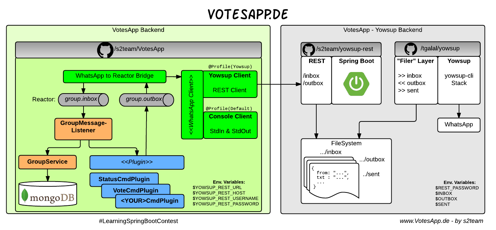
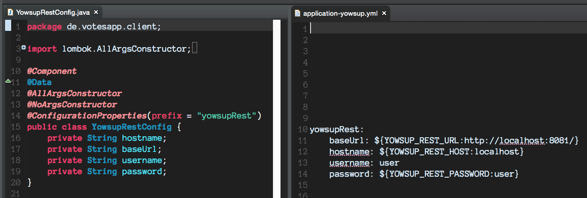
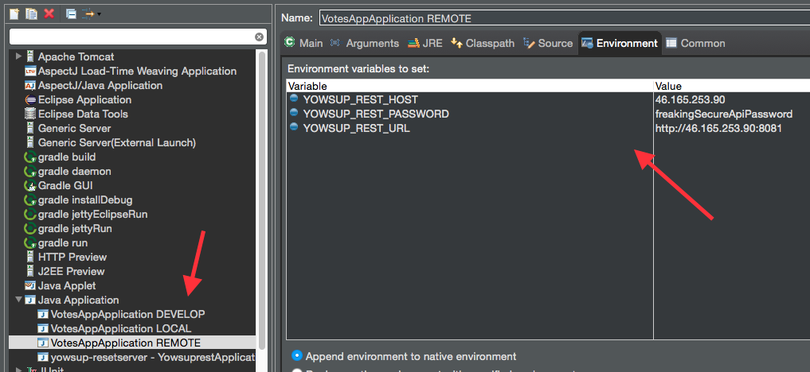
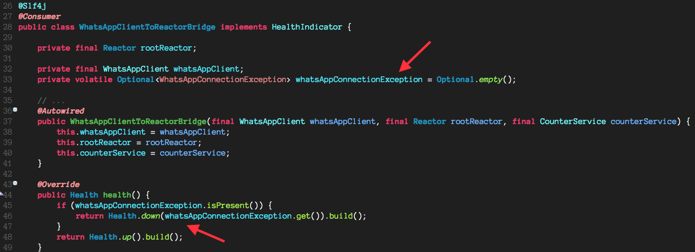
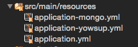

# About the project 
The project was developed to join the [Spring Boot Contest](https://github.com/learning-spring-boot/contest).

It is submitted by [@d0x (Christian Schneider)](https://github.com/d0x) and [@walery (Walery Strauch)](https://github.com/walery). If you have any ideas or feedback, contact us on Twitter or open a ticket on github.

During the contest we wrote a small [diary](https://github.com/s2team/contest#the-votesapp-diary).

Thank you for any kind of support! - s2.

# About VotesApp [](https://travis-ci.org/s2team/votesapp)
**VotesApp** is a *WhatsApp* Bot that helps you and your friends to organize Votes in *WhatsApp* groups.

As *WhatsApp* User the probability that you have a group together with some friends is quite huge. If not try it, it's a great feature. And when you are in a group like, it will happend that someone asks a question like, *Who likes to join Karting on Saturday?*, or *Whats about pizza today after work?*. Maybe you have such voting once a week for a fixed event like playing soccer in the evinig? Then it becomes quite hard to manage this.

Now you just invite **VotesApp** into your *WhatsApp* group.
Once joined, **VotesApp** will listen to the Keywords, `in`, `out`, `yes`, `no` to count votes and `status` to give the names of the people which voted for this keyword.

# Technology Stack
**VotesApp** is divided into the following three major backend stacks:

* **VotesApp**:
It's purpose is to communicate via ReST with the **Yowsup-Rest** backend to send and receive WhatsApp messages.
Inside the Application we put our logic behind an own `Plugin` API (blue).
That enables us to add more and more features over the time.
We utilize Reactor (gray) to pass messages forth and back to the Plugins.
As persistance layer we choose mongodb. This layer can runs as Standalone Application by default.
To integrate it with the others the `Yowsup`-profile needs to be active.

* **[Yowsup-Rest](https://github.com/s2team/yowsup-rest)**:
Thats a Spring Boot ReST-Service which abstracts all the Yowsup communication behind the two Resources `/inbox` and `/outbox`.

* **[Yowsup](https://github.com/s2team/yowsup)**:
Yowsup is a really cool 3rd Party Framework to communicates with WhatsApp.
On-Top of yowsup we put a "File" Layer to controll it from **Yowsup-Rest**.
Why Files? See [our diary](http://votesapp.de/10-01-2015/Python_brings_us_back_to_the_basics/).



We submit the VotesApp stack to the SpringBoot Content only.

# VotesApp Diary

To keep Readme clean, we moved the diary to: http://votesapp.de

# Run it on localhost
To run it in development mode, checkout the project and use the `bootRun` command to start it.

```
./gradlew bootRun
```

Now you can navigate your browser to "http://localhost:8080/" and access the WhatsApp/Yowsup mock.

> Integrating it with the real WhatsApp Servers can be done by using the `yowsup` and `mongo` profiles.
But this requieres a more complex setup (with https://github.com/s2team/yowsup and https://github.com/s2team/yowsup-rest) which we haven't submitted for the contest.
To make them run you need a SIM Card, an WhatsApp Password, ...
But to use and rate this application the "*developer*" mock should be enough.

Have a look to the Highlights section below for more insights.

# Highlights

This section describes some highlights of our Backend.

* Diary
* Extensibility with Plugins
* Developer "friendliness"
* @Value(#":}{}$:"#$@}#$!$), - em how was it?
* Environment Variables
* Cough, dude, I need some meds. Really, check my health!
* Profile Configuration
* 1, 2, 3, 4, metric

## Diary
From day zero we tried to put our experience during the contest into a diary.
Today it has more then 10 entries describing the fun we had.

## Extensibility with Plugins
During the contest we had a lot of ideas what else can be done with this.
Okay, ... the most important [Chuck Norris Plugin](https://github.com/s2team/votesapp/blob/master/src/main/java/de/votesapp/commands/plugins/ChuckNorrisCommandPlugin.java) is done.
But there are much more, - like the *Rock-paper-scissors*, *Cinema Moves*,
*Random Cats Videos* (@Kathy, this one is for you <3) or more advanced votings.

For those we provide this interface:

```java
public interface CommandPlugin {
  public abstract Optional<Answer> interpret(final GroupMessage message, final Group group);
}
```

In the simplest way it can be implemented like this:

```java
@Service
public class PingCommandPlugin extends TextEqualsWordPlugin {

  public static final String[] DEFAULT_RESETS = { "ping", "ping?" };

  public PingCommandPlugin() {
    super(DEFAULT_RESETS);
  }

  @Override
  public Optional<Answer> matches(final GroupMessage message, final Group group) {
    return Optional.of(Answer.intoGroup(group, "Pong!"));
  }
}
```

To see more about Plugins, you can checkout [our Diary post](http://votesapp.de/15-01-2015/Make_it_fucking_delightful/) about it.

## Developer "friendliness"
Nobody likes to have tons of configurations to do before start hacking, right?

So we took care that the application can be started without huzzle (excpect lombok...).
Services like MongoDB and Yowsup which aren't usable by default will mocked by "runnable" replacements.
This is done by utilizing the `@Profile` annotations.
When the `default` profile is loaded, [fongo](https://github.com/fakemongo/fongo) is used to replace the real MongoDb
and our `WebClient` replaced all the Yowsup Python stuff.

To use Fongo we only need to import `compile("com.github.fakemongo:fongo:1.5.9")` and provide this neat configuration:

```java
@Profile("!mongo")
@Configuration
static class MongoDbInMemoryConfiguration extends AbstractMongoConfiguration {

  @Override
  public MappingMongoConverter mappingMongoConverter() throws Exception {
    final MappingMongoConverter mappingMongoConverter = super.mappingMongoConverter();
    // WhatsApp Keys are containing dots in domains.
    mappingMongoConverter.setMapKeyDotReplacement("_");
    return mappingMongoConverter;
  }

  @Override
  protected String getDatabaseName() {
    return "test";
  }

  @Override
  public Mongo mongo() {
    return new Fongo("mongo").getMongo();
  }

  @Override
  protected String getMappingBasePackage() {
    return "de.votesapp";
  }
}
```

Please give [them](https://github.com/fakemongo/fongo) some fame on Github.
They are doing really great!

The `WebClient` is also activated by the same technique.
There we used the `@Profile("!yowsup")` annotation.

Once you configured both, you can active them with `--spring.profiles.active=yowsup,mongo`, or you just don't :).

## @Value(#":}{}$:"#$@}#$!$), - em how was it?
Okay, if you really use it all the day,
you probably know the syntax (because you understand whats going on).
But if I work with some Students or ppl. new to Spring, they really create every combination of parentheses,
dollars, braces and so on.

With Spring Boot those `@ConfigurationProperties` can be used.



Just create a counterpart of your configuration structure (yml) and it can be autowirred in your application.
That is so nice!

## Environment Variables
Our P-System is deployed using docker.
From there we don't really like to edit property files.
To get rid of them we use environment variables for the mandatory properties.

This makes it also handy to create various Eclipse 8Run Configurations* and an easy deployment.



## *Cough*, dude, I need some meds. Really, check my health!
The most critical (and not by AutoConfiguration monitored) Module in VotesApp is the communication to the Yowsup-Rest Server.
If this services isn't available, VotesApp can't work. Tracking it was really easy with SpringBoot.

Since we Poll for new message all day long, we can use this to detect the health.

We store exceptions, when they occur in an `Optional` field and anounce them over Springs `HealthIndicator`.



To see the status, you can check `http://localhost:8080/health`.

## Profile Configuration
We really like the feature to have properties per profile.
With this we were able to separate the configuration for mongodb, yowsup and our application.



## 1, 2, 3, 4, metric
We haven't expand them very much, but there are some metrics about how many messages we processed and how many are answered.
To do this we used Springs `CounterService` from the [GroupMessageListener](https://github.com/s2team/votesapp/blob/master/src%2Fmain%2Fjava%2Fde%2Fvotesapp%2Fgroups%2FGroupMessageListener.java)

As configured by default, they can be checked at `http://localhost:8080/metrics`.

# Thanks
That was a really great week! Independent of the result we like to give special thanks to:

* Greg for organizing this contest
* Tarek for your work on Yowsup. It was really interesting to have look at it
* The Spring Boot Team to make our work during this contest free of pain (regarding the java side)

We'll invite you both for beer, Greg when comming to US and Tarek when we are the next time in Berlin.
